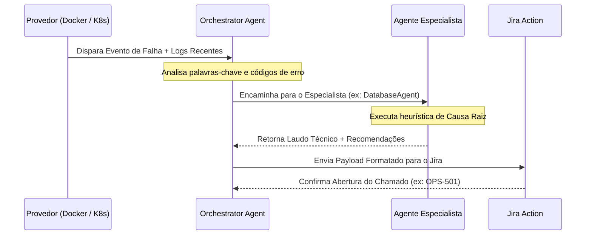

# 🤖 Guia do Sistema Multi-Agente de RCA — Guardian

O **Motor de Causa Raiz (RCA)** do Guardian é alimentado por uma arquitetura multi-agente autônoma estruturada em [`guardian_ops/agents/`](file:///home/jairosjunior/Documentos/Jairo/automação-jira/guardian-infra/guardian_ops/agents/). Cada agente é um especialista dedicado a um domínio específico da engenharia de software e infraestrutura.

---

## 1. 👥 Os 5 Agentes Especialistas

```
                      ┌────────────────────────────┐
                      │    Orchestrator Agent      │
                      │  (Classificação e Síntese) │
                      └─────────────┬──────────────┘
                                    │
        ┌───────────────────┬───────┴───────────┬───────────────────┐
        ▼                   ▼                   ▼                   ▼
┌───────────────┐   ┌───────────────┐   ┌───────────────┐   ┌───────────────┐
│ DevOps / SRE  │   │   Database    │   │      QA       │   │   Fullstack   │
│     Agent     │   │     Agent     │   │     Agent     │   │     Agent     │
│ (Pods/Docker) │   │  (SQL/NoSQL)  │   │  (APIs/Tests) │   │ (Apps/Stacks) │
└───────────────┘   └───────────────┘   └───────────────┘   └───────────────┘
```

### 1.1. 🧠 Orchestrator Agent (`orchestrator_agent.py`)
- **Responsabilidade**: Ponto de entrada de qualquer anomalia reportada pelos provedores de eventos.
- **Atuação**:
  1. Lê os metadados do container ou pod e os logs de stdout/stderr coletados.
  2. Classifica a severidade e o domínio provável da falha (Infraestrutura, Banco de Dados, Aplicação ou Pipeline).
  3. Despacha a investigação para o agente especialista correspondente.
  4. Agrega o laudo técnico e formata a descrição pronta para o Jira.

### 1.2. 🛠️ DevOps & SRE Agent (`devops_agent.py`)
- **Foco**: Ciclo de vida de contêineres, recursos do host e orquestração.
- **Padrões Detectados**:
  - `OOMKilled (ExitCode 137)`: Memória limite do Pod/Container insuficiente.
  - `CrashLoopBackOff`: Falha imediata de inicialização do processo principal.
  - `Port already in use`: Conflito de portas de rede no host.
  - `Permission denied`: Problemas de montagem de volumes ou IDs de usuário (UID/GID).

### 1.3. 🗄️ Database Agent (`database_agent.py`)
- **Foco**: Conectividade e integridade de bancos relacionais e NoSQL (PostgreSQL, MySQL, Redis, MongoDB).
- **Padrões Detectados**:
  - `Too many connections`: Esgotamento do pool de conexões com o banco.
  - `Access denied for user`: Credenciais incorretas ou senhas expiradas.
  - `Connection refused on port 3306/5432`: Instância do banco desligada ou inacessível via rede interna.
  - `Table/Index is corrupt` e `Deadlock found`.

### 1.4. 🧪 QA & Test Analyst Senior (`qa_agent.py`)
- **Foco**: Quebras de contrato em APIs e falhas em suítes de teste de esteiras CI/CD.
- **Padrões Detectados**:
  - `502 Bad Gateway / 504 Gateway Timeout`: Falha de upstream em reverse proxies.
  - `AssertionError / Test failed`: Quebra de asserções em testes unitários ou e2e.
  - Divergência de esquemas JSON retornados por microsserviços.

### 1.5. 💻 Fullstack Developer Agent (`fullstack_agent.py`)
- **Foco**: Exceções não tratadas nas camadas de aplicação (PHP, Node.js, Python, Go, Java).
- **Padrões Detectados**:
  - `Fatal error / Uncaught Exception`: Erros fatais que interrompem a execução.
  - `Module not found / ImportError`: Dependências não instaladas durante o build da imagem.
  - `NullPointerException / TypeError`: Acesso a propriedades nulas ou variáveis indefinidas.

---

## 2. 🔄 Fluxo de Processamento de Incidentes



---

## 3. 🧩 Como Adicionar um Novo Agente Especialista

O sistema foi desenhado para facilitar a inclusão de novos agentes. Basta herdar de `BaseAgent` em [`guardian_ops/agents/base_agent.py`](file:///home/jairosjunior/Documentos/Jairo/automação-jira/guardian-infra/guardian_ops/agents/base_agent.py):

```python
from guardian_ops.agents.base_agent import BaseAgent

class SecurityAgent(BaseAgent):
    """Agente especializado em detecção de anomalias de segurança e certificados."""
    
    def can_handle(self, event_data: dict) -> bool:
        logs = event_data.get("logs", "").lower()
        return "certificate expired" in logs or "ssl handshake failure" in logs

    def analyze(self, event_data: dict) -> dict:
        return {
            "agent": "SecurityAgent",
            "root_cause": "Certificado TLS/SSL expirado ou inválido.",
            "severity": "CRITICAL",
            "suggested_actions": [
                "Renovar o certificado via Cert-Manager ou Let's Encrypt.",
                "Verificar a validade das Secrets TLS no namespace correspondente."
            ]
        }
```
Em seguida, registre o novo agente na lista de especialistas em `orchestrator_agent.py`.
