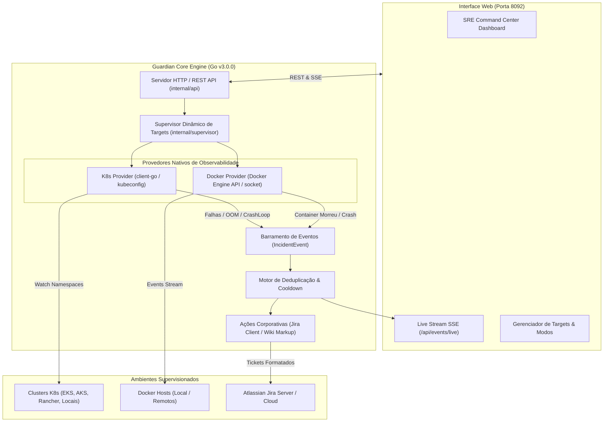

# Guardian — Autonomous Enterprise SRE & Incident Automation Platform

<p align="center">
  
  
  
  
  
</p>

---

## 1. Visão Geral

O **Guardian** é uma plataforma corporativa e autônoma de observabilidade, supervisão de infraestrutura e resposta automatizada a incidentes para times de SRE e DevOps.

A versão **v3.0.0 (Enterprise Hybrid)** consolida o Guardian como um **aplicativo standalone único**, eliminando a necessidade de serviços picotados ou containers auxiliares de monitoramento. Todo o ciclo de vida — desde a detecção em tempo real de falhas no Kubernetes ou Docker até a abertura de incidentes formatados no Jira — roda diretamente em um único binário nativo com servidor web e dashboard embutidos.

---

## 2. Principais Novidades da Release v3.0.0

* 🛡️ **Arquitetura Híbrida Unificada (Kubernetes + Docker Nativo):**
  * **Kubernetes:** Descoberta automática de contextos em `~/.kube/config` e `Documentos/kube-config*`, monitoramento dinâmico via `client-go` informers por Namespace sob demanda.
  * **Docker:** Conexão nativa direta ao socket `/var/run/docker.sock` ou hosts remotos via SSH/TCP, inspecionando containers e capturando eventos sem intermediários.
* 🖥️ **Novo Portal Web & SRE Command Center (Porta 8092):**
  * Interface visual moderna em Dark Mode com navegação lateral (*Sidebar*).
  * Dashboard de targets com telemetria em tempo real, badges de status (*ACTIVE*, *PAUSED*, *ERROR*) e contadores executivos.
  * Live Stream de incidentes em tempo real utilizando Server-Sent Events (**SSE** na rota `/api/events/live`).
* ⚡ **Descoberta Multicluster com Cache e Paginação:**
  * Carregamento paralelo não-bloqueante de múltiplos clusters e hosts.
  * Paginação inteligente nos feeds de eventos e targets para ambientes de larga escala.
* 🎫 **Integração Corporativa Jira Aprimorada:**
  * **Wiki Markup Nativa:** Substituição completa de emojis 4-bytes por tabelas e painéis corporativos nativos do Jira, garantindo 100% de compatibilidade com qualquer banco (MySQL/PostgreSQL/Oracle) sem erros de codificação UTF-8.
  * **Deduplicação Inteligente (Anti-Spam):** Janela de cooldown configurável por assinatura única de incidente (*fingerprint*), evitando flood de chamados duplicados.
  * **Auto-Discovery de Issue Types:** Reconhece e mapeia dinamicamente os tipos de chamados aceitos pelo projeto no Jira.
* 🎛️ **Controle Dinâmico de Operação:**
  * Alternância instantânea entre **Modo Dry-Run (Auditoria/Simulação)** e **Modo Produção (Atuação Ativa)** direto pela interface web sem precisar reiniciar o binário.
* 📦 **Zero Dependências em Runtime:**
  * Binário compilado autossuficiente (`./guardian`). Não necessita de Python, Docker containers ou daemons externos para executar o monitoramento.

---

## 3. Arquitetura da Solução



---

## 4. Como Compilar e Executar

### Pré-requisitos
* **Go 1.22+** instalado na estação/servidor.
* Arquivo de configuração do Kubernetes (`~/.kube/config`).
* Permissão de leitura no socket do Docker (caso vá monitorar Docker local):
  ```bash
  sudo usermod -aG docker $USER
  # ou liberar temporariamente:
  sudo chmod 666 /var/run/docker.sock
  ```

### Compilação do Binário
```bash
# Na raiz do repositório
go build -o guardian ./cmd/guardian
```

### Execução
```bash
# Executando na porta 8092 (ou defina a porta desejada)
./guardian -port 8092
```

Acesse a interface no seu navegador: **`http://localhost:8092`**

---

## 5. Flags de Linha de Comando

| Flag | Tipo | Padrão | Descrição |
| :--- | :--- | :--- | :--- |
| `-port` | `int` | `8080` | Porta TCP do servidor web e API HTTP. |
| `-dry-run` | `bool` | `false` | Se ativo, audita e loga falhas sem criar chamados reais no Jira. |
| `-kubeconfig` | `string` | `~/.kube/config` | Caminho customizado para o arquivo de configuração do Kubernetes. |
| `-docker-host` | `string` | `/var/run/docker.sock` | Caminho do socket local ou URL do Docker daemon. |

---

## 6. Variáveis de Ambiente (`.env`)

Crie ou edite o arquivo `.env` na raiz do projeto para configurar integrações corporativas:

```env
# Integração com o Jira
JIRA_URL=https://jira.suaempresa.com.br
JIRA_USER=seu_usuario_ou_email
JIRA_API_TOKEN=seu_token_de_acesso
JIRA_PROJECT_KEY=OPS
JIRA_ISSUE_TYPE=Incidente

# Configurações de Deduplicação
COOLDOWN_MINUTES=60

# Modo de Operação Inicial
DRY_RUN=false
PORT=8092
```

---

## 7. Estrutura do Repositório

```text
guardian-infra/
├── cmd/
│   └── guardian/
│       └── main.go                 # Entrypoint da aplicação Go v3.0.0
├── internal/
│   ├── api/                        # Servidor HTTP, rotas REST e SSE Live Stream
│   ├── supervisor/                 # Gerenciamento dinâmico do ciclo de vida dos Targets
│   ├── providers/                  # Provedores de observabilidade nativos
│   │   ├── k8s/                    # client-go discovery, informers e watch de namespaces
│   │   └── docker/                 # Inspecção de containers e stream de eventos do Docker
│   ├── actions/                    # Pipeline de ações (Jira Client com Wiki Markup)
│   ├── domain/                     # Modelos de domínio (Target, IncidentEvent)
│   └── storage/                    # Persistência de estado local (targets.json)
├── web/                            # Interface gráfica web (HTML, Tailwind CSS, Lucide, SSE)
├── targets.json                    # Armazenamento local dos targets configurados
├── go.mod                          # Módulos e dependências oficiais do Go
├── go.sum                          # Checksums das dependências
└── README.md                       # Este documento
```

---

## 8. Principais Rotas da API REST

| Método | Endpoint | Descrição |
| :--- | :--- | :--- |
| `GET` | `/api/health` | Status de saúde do Guardian, modo atual (Dry-Run / Prod) e versão. |
| `GET` | `/api/targets` | Lista todos os targets cadastrados e seus estados. |
| `POST` | `/api/targets` | Cria um novo target (Kubernetes ou Docker). |
| `PUT` | `/api/targets/{id}` | Atualiza regras, ações ou pausa/ativa um target. |
| `DELETE` | `/api/targets/{id}` | Remove um target da supervisão. |
| `GET` | `/api/events/live` | Stream contínuo de eventos via Server-Sent Events (**SSE**). |
| `GET` | `/api/events/history` | Histórico consolidado de incidentes capturados. |
| `GET` | `/api/discovery/environments` | Lista contextos K8s e namespaces disponíveis. |
| `GET` | `/api/discovery/docker/inspect` | Diagnóstico de conexão e containers do Docker host. |
| `POST` | `/api/settings/toggle-dry-run` | Alterna em tempo real entre Dry-Run e Produção. |

---

## 9. Histórico de Versões

* **`v3.0.0` (Versão Atual - 21/Set/2026):**
  * Unificação definitiva em aplicativo standalone único em Go.
  * Suporte híbrido (Kubernetes multicluster + Docker socket nativo).
  * Web UI executiva completa com modo escuro, sidebar e live stream SSE.
  * Formatação Wiki Markup corporativa no Jira sem emojis 4-bytes.
  * Cache multicluster, paginação e controle dinâmico de Dry-Run via web.
* **`v2.0.0`:**
  * Prototipagem da arquitetura de targets sob demanda e primeiros informers K8s.
* **`v1.0.0`:**
  * Daemon inicial em Python monitorando containers locais via docker-compose.

---

<p align="center">
  <b>Guardian SRE Platform</b> • Desenvolvido para máxima resiliência e observabilidade corporativa.
</p>
