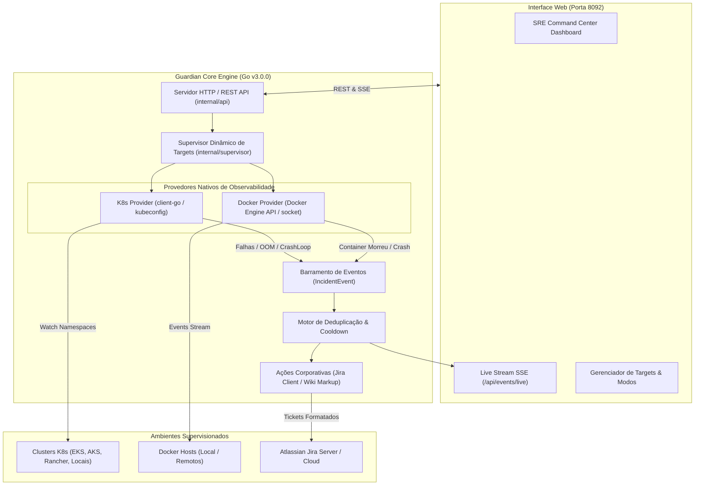

# Guardian — Autonomous Enterprise SRE & Incident Automation Platform

<p align="center">
  
  
  
  
  
  
</p>

---

## 1. Visão Geral

O **Guardian** é uma plataforma corporativa e autônoma de observabilidade, supervisão de infraestrutura e resposta automatizada a incidentes para times de SRE e DevOps, **oficialmente desenvolvida e padronizada em linguagem Go**.

A arquitetura moderna consolida o Guardian como um **aplicativo nativo multiplataforma (Linux & Windows)**, eliminando a necessidade de runtimes externos, scripts interpretados ou containers auxiliares de monitoramento. Todo o ciclo de vida — desde a detecção em tempo real de falhas no Kubernetes ou Docker até a abertura de incidentes formatados no Jira — roda diretamente em um único binário nativo com servidor web e dashboard embutidos.

---

## 2. Principais Novidades da Release v3.0.0

* 🛡️ **Arquitetura Híbrida Unificada (Kubernetes + Docker Nativo):**
  * **Kubernetes:** Descoberta automática de contextos em `~/.kube/config` e `Documentos/kube-config*`, monitoramento dinâmico via `client-go` informers por Namespace sob demanda.
  * **Docker:** Conexão nativa direta ao socket `/var/run/docker.sock` ou hosts remotos via SSH/TCP, inspecionando containers e capturando eventos sem intermediários.
* 🖥️ **Novo Portal Web & SRE Command Center (Porta 8092):**
  * Interface visual moderna em Dark Mode com navegação lateral (*Sidebar*).
  * Dashboard de targets com telemetria em tempo real, badges de status (*ACTIVE*, *PAUSED*, *ERROR*) e contadores executivos.
  * Live Stream de incidentes em tempo real utilizando Server-Sent Events (**SSE** na rota `/api/events/live`).
* ⚡ **Descoberta Multicluster com Cache e Paginação:**
  * Carregamento paralelo não-bloqueante de múltiplos clusters e hosts.
  * Paginação inteligente nos feeds de eventos e targets para ambientes de larga escala.
* 🎫 **Integração Corporativa Jira Aprimorada:**
  * **Wiki Markup Nativa:** Substituição completa de emojis 4-bytes por tabelas e painéis corporativos nativos do Jira, garantindo 100% de compatibilidade com qualquer banco (MySQL/PostgreSQL/Oracle) sem erros de codificação UTF-8.
  * **Deduplicação Inteligente (Anti-Spam):** Janela de cooldown configurável por assinatura única de incidente (*fingerprint*), evitando flood de chamados duplicados.
  * **Auto-Discovery de Issue Types:** Reconhece e mapeia dinamicamente os tipos de chamados aceitos pelo projeto no Jira.
* 🎛️ **Controle Dinâmico de Operação:**
  * Alternância instantânea entre **Modo Dry-Run (Auditoria/Simulação)** e **Modo Produção (Atuação Ativa)** direto pela interface web sem precisar reiniciar o binário.
* 📦 **Zero Dependências em Runtime:**
  * Binário compilado autossuficiente (`./guardian`). Não necessita de Python, Docker containers ou daemons externos para executar o monitoramento.

---

## 3. Arquitetura da Solução



---

## 4. Ciclo de Vida: Instalação, Atualização e Remoção no Linux

O Guardian conta com um **Gerenciador Central de Ciclo de Vida (`./install.sh`)** para instalação nativa no desktop (Zorin OS, Ubuntu, Debian, GNOME, KDE), atalhos de sistema, serviço de segundo plano (`systemd`) e rotinas automáticas de upgrade e rollback.

### 🚀 Menu Interativo Central (TUI)
Para abrir o menu interativo com diagnóstico em tempo real:
```bash
./install.sh
```

---

### 1️⃣ Instalação Inicial
```bash
# Opção A: Instalação local em ~/.local (Recomendado, sem sudo)
make install
# ou: ./install.sh --install

# Opção B: Instalação global (/usr/local, requer sudo)
make install-system
# ou: sudo ./install.sh --system

# Opção C: Pacote Debian nativo (.deb)
make deb
sudo dpkg -i dist/guardian_3.1.0_amd64.deb
```

---

### 2️⃣ Como Atualizar Quando Gerar uma Nova Versão
Ao criar novas funcionalidades ou correções no código, você pode atualizar a aplicação instalada na sua máquina com **apenas 1 comando**:

```bash
# Passo 1 (Opcional): Incrementar a versão semântica (patch, minor ou major)
make bump-patch     # ex: 3.1.0 -> 3.1.1
# ou make bump-minor # ex: 3.1.0 -> 3.2.0

# Passo 2: Executar a atualização automática
make update
# ou: ./install.sh --update
# ou de qualquer pasta no terminal: guardian-ctl update
```

> **O que a atualização automática faz nos bastidores:**
> 1. Pausa com segurança o serviço ativo para evitar erros de `Text file busy`.
> 2. Salva um backup da versão anterior em `~/.local/bin/guardian.bak`.
> 3. Compila o novo binário Go injetando a versão, commit do Git e data do build.
> 4. Substitui o executável e atualiza atalhos e ícones.
> 5. **Preserva 100%** de suas configurações (`guardian.env`) e targets registrados (`targets.json`).
> 6. Reinicia o serviço no `systemd` e valida a saúde da API (`/api/health`).

---

### 3️⃣ Reversão Imediata (Rollback)
Se a nova versão apresentar alguma incompatibilidade, reverta instantaneamente:
```bash
make rollback
# ou: ./install.sh --rollback
# ou: guardian-ctl rollback
```

---

### 4️⃣ Remoção / Desinstalação
```bash
# Desinstalação padrão (remove binários e atalhos, preservando dados/configurações)
make uninstall
# ou: ./install.sh --uninstall
# ou: guardian-ctl uninstall

# Desinstalação completa (remove também bancos e arquivos de configuração)
make purge
# ou: ./install.sh --purge
```

---

### 5️⃣ Formas de Uso após a Instalação
* **Pelo Menu de Aplicativos:** Pressione a tecla `Super/Windows`, digite **Guardian SRE** e clique no ícone para abrir a aplicação em sua janela desktop nativa.
* **Linha de Comando (CLI):**
  * `guardian-app` ou `guardian-ctl open`: Abre diretamente a janela de aplicativo desktop.
  * `guardian-ctl status`: Exibe status, targets ativos e telemetria.
  * `guardian-ctl update`: Atualiza para a versão mais recente do repositório.
  * `guardian-ctl rollback`: Restaura a versão anterior salva em backup.
  * `guardian-ctl start` / `guardian-ctl stop`: Inicia ou para o motor em background.
  * `guardian-ctl logs`: Acompanha os logs em tempo real.
* **Serviço systemd:**
  * `systemctl --user start guardian`
  * `systemctl --user status guardian`

---

### 💻 Execução Direta via Terminal (Desenvolvimento)
```bash
# Compilar binário standalone
make build

# Executar abrindo direto a janela desktop nativa
./bin/guardian -gui

# Ou executar apenas como servidor na porta 8092
./bin/guardian -port 8092
```

Acesse a interface no seu navegador ou janela de aplicativo: **`http://localhost:8092`**

---

## 5. Suporte Oficial a Windows (`guardian.exe`)

O Guardian é oficialmente compilado para Windows x64 (`amd64`), oferecendo paridade total de recursos, telemetria em tempo real e automação Jira:

### 🚀 Executando no Windows
* **Opção 1 (Launcher Interativo):** Dê um duplo-clique no arquivo `guardian.bat`. Ele detectará o binário e iniciará automaticamente a aplicação no navegador ou em janela de aplicativo standalone (Edge / Chrome).
* **Opção 2 (Prompt de Comando ou PowerShell):**
  ```powershell
  # Abrir diretamente com interface gráfica desktop nativa
  .\guardian.exe -gui

  # Iniciar como servidor na porta 8092
  .\guardian.exe -port 8092

  # Executar em modo Dry-Run (simulação)
  .\guardian.exe -dry-run=true

  # Informar kubeconfig do Windows
  .\guardian.exe -kubeconfig "$env:USERPROFILE\.kube\config"
  ```

### ⚙️ Como Compilar para Windows no Linux (Cross-Compilation)
Para gerar o executável Windows (`guardian.exe` e `bin/guardian.exe`):
```bash
make exe
# ou manualmente:
GOOS=windows GOARCH=amd64 CGO_ENABLED=0 go build -ldflags="-s -w" -o guardian.exe ./cmd/guardian
```
O binário resultante é 100% autossuficiente e standalone, sem necessidade de instalação de Python, runtimes ou dependências externas no Windows.

---

## 6. Flags de Linha de Comando

| Flag | Tipo | Padrão | Descrição |
| :--- | :--- | :--- | :--- |
| `-port` | `int` | `8080` | Porta TCP do servidor web e API HTTP. |
| `-dry-run` | `bool` | `false` | Se ativo, audita e loga falhas sem criar chamados reais no Jira. |
| `-kubeconfig` | `string` | `~/.kube/config` | Caminho customizado para o arquivo de configuração do Kubernetes. |
| `-docker-host` | `string` | `/var/run/docker.sock` | Caminho do socket local ou URL do Docker daemon. |

---

---

## 7. Variáveis de Ambiente (`.env`)

Crie ou edite o arquivo `.env` na raiz do projeto para configurar integrações corporativas:

```env
# Integração com o Jira
JIRA_URL=https://jira.suaempresa.com.br
JIRA_USER=seu_usuario_ou_email
JIRA_API_TOKEN=seu_token_de_acesso
JIRA_PROJECT_KEY=OPS
JIRA_ISSUE_TYPE=Incidente

# Configurações de Deduplicação
COOLDOWN_MINUTES=60

# Modo de Operação Inicial
DRY_RUN=false
PORT=8092
```

---

## 8. Estrutura do Repositório

```text
guardian-infra/
├── cmd/
│   └── guardian/
│       └── main.go                 # Entrypoint da aplicação Go v3.1.0
├── internal/
│   ├── api/                        # Servidor HTTP, rotas REST e SSE Live Stream
│   ├── supervisor/                 # Gerenciamento dinâmico do ciclo de vida dos Targets
│   ├── providers/                  # Provedores de observabilidade nativos
│   │   ├── k8s/                    # client-go discovery, informers e watch de namespaces
│   │   └── docker/                 # Inspecção de containers e stream de eventos do Docker
│   ├── actions/                    # Pipeline de ações (Jira Client com Wiki Markup)
│   ├── domain/                     # Modelos de domínio (Target, IncidentEvent)
│   ├── desktop/                    # Launcher gráfico multiplataforma (Linux & Windows)
│   ├── version/                    # Controle dinâmico de versão e build
│   └── storage/                    # Persistência de estado local (targets.json)
├── packaging/                      # Manifestos .desktop, ícones e systemd
├── scripts/                        # Scripts de automação, packaging e versionamento
├── web/                            # Interface gráfica web (HTML, Tailwind CSS, Lucide, SSE)
├── guardian.exe                    # Executável compilado nativo para Windows
├── guardian.bat                    # Script launcher de inicialização no Windows
├── Makefile                        # Automação de compilação, testes, empacotamento e releases
├── go.mod                          # Módulos e dependências oficiais do Go
├── go.sum                          # Checksums das dependências
└── README.md                       # Este documento
```

---

## 9. Principais Rotas da API REST

| Método | Endpoint | Descrição |
| :--- | :--- | :--- |
| `GET` | `/api/health` | Status de saúde do Guardian, modo atual (Dry-Run / Prod) e versão. |
| `GET` | `/api/targets` | Lista todos os targets cadastrados e seus estados. |
| `POST` | `/api/targets` | Cria um novo target (Kubernetes ou Docker). |
| `PUT` | `/api/targets/{id}` | Atualiza regras, ações ou pausa/ativa um target. |
| `DELETE` | `/api/targets/{id}` | Remove um target da supervisão. |
| `GET` | `/api/events/live` | Stream contínuo de eventos via Server-Sent Events (**SSE**). |
| `GET` | `/api/events/history` | Histórico consolidado de incidentes capturados. |
| `GET` | `/api/discovery/environments` | Lista contextos K8s e namespaces disponíveis. |
| `GET` | `/api/discovery/docker/inspect` | Diagnóstico de conexão e containers do Docker host. |
| `POST` | `/api/settings/toggle-dry-run` | Alterna em tempo real entre Dry-Run e Produção. |

---

## 10. Histórico de Versões

* **`v3.1.0` (Versão Atual - 25/Set/2026):**
  * Oficialização e consolidação da linguagem Go como motor central nativo e exclusivo do Guardian.
  * Suporte oficial completo a **Windows** (`guardian.exe` standalone de 33MB e script launcher `guardian.bat`).
  * Launcher desktop nativo multiplataforma (Edge / Chrome / Brave em modo `--app` no Linux e Windows).
  * Injeção dinâmica de metadados de versão (`Version`, `GitCommit`, `BuildDate`) via ldflags.
  * Novos comandos no Makefile (`make exe`, `make update`, `make rollback`, `make deb`).
* **`v3.0.0`:**
  * Unificação definitiva em aplicativo standalone em Go.
  * Suporte híbrido (Kubernetes multicluster + Docker socket nativo).
  * Web UI executiva completa com modo escuro, sidebar e live stream SSE.
  * Formatação Wiki Markup corporativa no Jira sem emojis 4-bytes.
  * Cache multicluster, paginação e controle dinâmico de Dry-Run via web.
* **`v2.0.0`:**
  * Prototipagem da arquitetura de targets sob demanda e primeiros informers K8s.
* **`v1.0.0`:**
  * Daemon inicial em Python monitorando containers locais via docker-compose.

---

<p align="center">
  <b>Guardian SRE Platform</b> • Desenvolvido para máxima resiliência e observabilidade corporativa.
</p>
