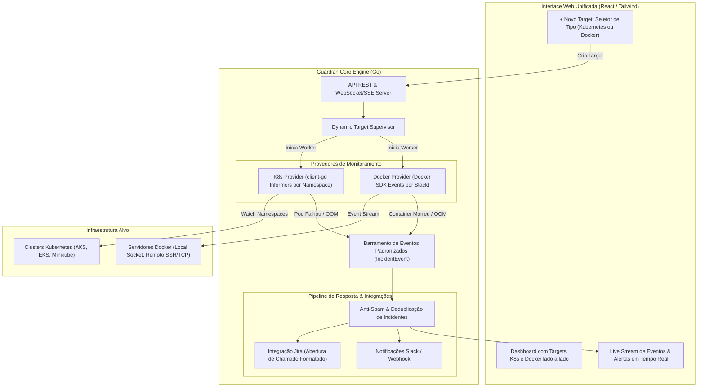

# Arquitetura do Guardian: Supervisor Híbrido de Targets (Kubernetes + Docker)

## 1. Visão Geral e Conceito Unificado

O **Guardian** é uma plataforma de observabilidade ativa, diagnóstico automatizado e resposta a incidentes projetada para operar em ambientes **Kubernetes**, **Docker puro** ou **Híbridos**.

Em vez de agentes estáticos que monitoram tudo e sobrecarregam a infraestrutura, o Guardian opera no conceito de **Targets**:
- O operador define via interface web **quais ambientes** e **quais escopos específicos** devem ser monitorados.
- O Guardian aloca recursos, watchers e conexões HTTP/2 / Docker Streams **sob demanda**, cancelando-os imediatamente quando um target é pausado.

---

## 2. Equivalência Conceitual: Kubernetes vs. Docker

O Guardian abstrai os dois mundos sob uma mesma camada de domínio:

| Dimensão | Kubernetes | Docker Puro |
| :--- | :--- | :--- |
| **Ambiente / Host** | Cluster Context (ex: `aks-prod`, `eks-east`) | Docker Host / Context (`/var/run/docker.sock` ou SSH/TCP) |
| **Escopo do Target** | **Namespace** (ex: `billing`, `checkout`) | **Docker Compose Project** ou Labels (ex: `ecommerce-stack`) |
| **Unidade de Execução** | Pod / Container | Container |
| **Motor de Eventos** | `client-go` Informers (`WithNamespace`) | Docker Events Stream (`client.Events`) |
| **Gatilhos de Falha** | `CrashLoopBackOff`, `OOMKilled`, `Error` | `event: die` (exitCode != 0), `event: oom`, `unhealthy` |
| **Coleta de Diagnóstico** | `kubectl logs --tail=50 --previous` | `docker logs --tail=50` |
| **Ação / Chamado** | Chamado no Jira com logs do Pod | Chamado no Jira com logs do Container |

---

## 3. Diagrama da Arquitetura Híbrida



---

## 4. Estrutura de Domínio Unificada (Go)

### 4.1. O Modelo do Target
```go
type EnvironmentType string

const (
    EnvKubernetes EnvironmentType = "KUBERNETES"
    EnvDocker     EnvironmentType = "DOCKER"
)

type TargetStatus string

const (
    StatusActive TargetStatus = "ACTIVE"
    StatusPaused TargetStatus = "PAUSED"
    StatusError  TargetStatus = "ERROR"
)

type Target struct {
    ID          string          `json:"id"`
    Name        string          `json:"name"`        // ex: "Pagamentos Produção"
    Type        EnvironmentType `json:"type"`        // KUBERNETES ou DOCKER
    Endpoint    string          `json:"endpoint"`    // Contexto K8s ou Host Docker (ex: "aks-prod" ou "srv-docker-01")
    Scopes      []string        `json:"scopes"`      // K8s Namespaces OU Docker Compose Stacks
    Rules       MonitoringRules `json:"rules"`       // CrashLoop, OOMKilled, Healthcheck
    Actions     ActionConfig    `json:"actions"`     // Jira, Slack, AutoRestart
    Status      TargetStatus    `json:"status"`
    CreatedAt   time.Time       `json:"created_at"`
}
```

### 4.2. O Evento Padronizado (`IncidentEvent`)
O barramento de ações do Guardian trata todos os incidentes de forma homogênea:

```go
type IncidentEvent struct {
    ID           string          `json:"id"`
    Type         EnvironmentType `json:"type"`           // KUBERNETES ou DOCKER
    TargetID     string          `json:"target_id"`
    Environment  string          `json:"environment"`     // ex: "aks-prod-brazil" ou "srv-docker-01"
    Scope        string          `json:"scope"`           // Namespace ou Compose Project
    EntityName   string          `json:"entity_name"`     // Nome do Pod ou Container
    Image        string          `json:"image"`           // Imagem do container
    Reason       string          `json:"reason"`          // OOMKilled, CrashLoopBackOff, Die (ExitCode != 0)
    ExitCode     int             `json:"exit_code"`
    Logs         string          `json:"logs"`            // Últimos 50 logs coletados antes do crash
    Timestamp    time.Time       `json:"timestamp"`
}
```

---

## 5. Integração com o Sistema de Chamados (Jira)

A integração com o Jira é unificada e inteligente:
1. **Deduplicação (Anti-Spam)**: Se o mesmo Pod ou Container reiniciar 10 vezes em 3 minutos, o Guardian não abre 10 chamados duplicados. Ele agrupa sob a mesma issue ou aplica uma janela de cooldown.
2. **Contexto Rico**: O ticket é criado via REST API (`POST /rest/api/2/issue`) contendo:
   - Identificação do Ambiente (Kubernetes ou Docker).
   - Servidor/Cluster e Namespace/Stack afetada.
   - Código de saída (ex: Exit Code 137 para OOM).
   - Últimos 50 logs anexados formatados em bloco de código.

### Exemplo de Ticket Gerado:
```text
Projeto: INFRA
Tipo: Incidente
Resumo: [Incidente K8s] Pod payment-api-84f98d em CrashLoopBackOff (Namespace: billing)
Descrição:
  - Ambiente: Kubernetes
  - Cluster: aks-prod-brazil
  - Namespace: billing
  - Pod: payment-api-84f98d-lm8w9
  - Motivo: CrashLoopBackOff (Container: app falhou consecutivamente)
  - Data/Hora: 18/09/2026 16:10:00

  --- ÚLTIMOS LOGS DO CONTAINER ANTES DA QUEDA ---
  [FATAL] Conexão recusada no banco de dados após 3 tentativas
  [ERROR] panic: runtime error: invalid memory address or nil pointer dereference
```

---

## 6. Estrutura de Pastas do Projeto (Go)

```text
guardian/
├── cmd/
│   └── guardian/
│       └── main.go                 # Entrypoint da aplicação
├── internal/
│   ├── config/                     # Configurações gerais (Jira URL, Tokens, etc.)
│   ├── domain/                     # Modelos centrais (Target, IncidentEvent, Provider)
│   ├── supervisor/                 # Gerenciador de ciclo de vida dos Targets
│   │   ├── supervisor.go           # Worker pool dinâmico (Start/Stop de goroutines)
│   │   └── worker.go
│   ├── providers/                  # Provedores de observabilidade
│   │   ├── k8s/
│   │   │   ├── client_pool.go      # Cache de clientes client-go por contexto
│   │   │   ├── discovery.go        # Listagem de contextos e namespaces
│   │   │   └── informer.go         # SharedInformers filtrados por namespace
│   │   └── docker/
│   │       ├── client_pool.go      # Clientes Docker (Local Socket / SSH / TCP)
│   │       ├── discovery.go        # Listagem de hosts e compose projects
│   │       └── events.go           # Docker Events stream por stack
│   ├── storage/                    # Persistência dos targets (SQLite)
│   ├── api/                        # Servidor HTTP / REST / WebSocket
│   └── actions/                    # Pipeline de ações
│       ├── deduplicator.go         # Lógica anti-spam de incidentes
│       ├── jira.go                 # Client da API do Jira
│       └── notifier.go             # Notificações em tempo real
├── web/                            # Interface Web (React / Tailwind)
│   ├── src/
│   │   ├── components/TargetModal.tsx   # Seletor K8s vs Docker
│   │   ├── components/LiveFeed.tsx
│   │   └── components/HostCards.tsx
│   └── dist/                       # Build embutido via //go:embed
├── go.mod
└── go.sum
```

---

## 7. Distribuição e Deploy

- **Modo Standalone (DevOps Workstation)**:
  Um único binário `./guardian` que lê seu `~/.kube/config` e `/var/run/docker.sock` local e sobe a interface na porta `8080`.
- **Modo Container (Docker Compose)**:
  Um container de ~15MB com montagem de volume para `/var/run/docker.sock` e `~/.kube/config`.
